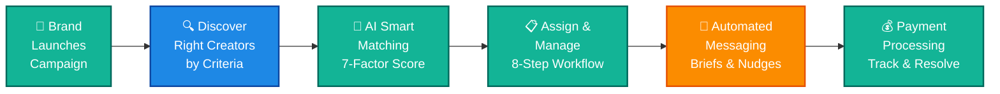

# BigBell — Platform Presentation

> **For the client.** Two diagrams below. Copy the mermaid blocks into any renderer (GitHub, VS Code Mermaid Preview, Notion, or export to PNG via [mermaid.live](https://mermaid.live)).

---

## 1. How BigBell Works — End-to-End Journey

### What ships when

| Step | What it does | Status |
|------|-------------|--------|
| 🏢 Brand Launches Campaign | Ops creates campaign — title, brand, budget, deadline, target niches & languages | **Live today** |
| 🔍 Creator Discovery | Search Instagram (Meta Marketplace), YouTube, and local CSV by **region, niche, language, min-followers**. Multi-source with mock fallback — always works, even without API keys | **Phase 1 — Ships first** |
| 🎯 Smart AI Matching | ONNX embedding similarity + 7-factor weighted scoring (niche, language, reach, engagement, quality, completeness, budget-fit). Ranked results with alignment breakdown | **Live today** |
| 📋 Assign & Manage | 8-state lifecycle: Matched → Invited → Accepted → Brief Sent → Content Received → Approved → Paid. Advance, reject, or unassign with one click | **Live today** |
| 💬 Automated Messaging | Every lifecycle transition auto-composes a brief/invite/nudge into the Helpdesk thread. Draft-first — ops reviews before sending. WhatsApp → Email → In-app (always works as fallback) | **Phase 2 — Follow-up** |
| 💰 Payment Processing | CRUD payments, track status (pending → processed → paid → disputed), per-creator payouts, CSV import/export | **Live today** |

---

## 2. Platform Architecture

```mermaid
flowchart TD
    classDef live fill:#13B496,color:#fff,stroke:#00695C,stroke-width:2px
    classDef p1 fill:#1E88E5,color:#fff,stroke:#0D47A1,stroke-width:2px
    classDef p2 fill:#FB8C00,color:#fff,stroke:#E65100,stroke-width:2px
    classDef neutral fill:#FAFBFC,color:#1A1A2E,stroke:#B0BEC5,stroke-width:1px

    %% ── External Sources ──
    META["Meta Creator Marketplace API"]:::p1
    YT["YouTube Data API"]:::live
    CSV["Local CSV / Upload"]:::live
    KB["FAQ Knowledge Base · 30 articles\nChroma vector store"]:::neutral

    %% ── Storage Layer ──
    subgraph STORAGE["Pluggable Storage  (JSON · SQLite · API)"]
        IR["Instagram Creator Repo\nfetch + mock fallback"]:::p1
        YR["YouTube Creator Repo\nexisting pattern"]:::live
        JR["JSON / DB Repos\ncreators · campaigns · payments\nassignments · notes"]:::live
    end

    %% ── Services Layer ──
    subgraph SERVICES["Domain Services"]
        CS["Creator Service\nsearch · filter · tier stats"]:::live
        AS["Assignment Service\n8-state lifecycle engine"]:::live
        HS["Helpdesk Service\ninbox · auto-answer · send"]:::live
    end

    %% ── AI Agents Layer ──
    subgraph AI["AI Intelligence  (mock + LLM dual mode)"]
        MATCH["Matching Agent\nniche embedding + scoring"]:::live
        REV["Review · Verify · Categorize\napplication pipeline"]:::live
        EXT["Extraction Agent\ntext / WhatsApp / PDF"]:::live
        QA["Query Agent\nRAG FAQ with citations"]:::live
        NOTIFY["Assignment Notifier\nbriefs · invites · nudges"]:::p2
    end

    %% ── UI Layer ──
    subgraph UI["Streamlit UI  (10 pages)"]
        direction LR
        DASH["Dashboard"]:::live
        CREATORS["All Creators\n+ Region Filter"]:::p1
        MATCHPAGE["Match Creators\nFind + Smart Match"]:::live
        HELP["AI Helpdesk\nInbox + KB"]:::live
        PAY["Payments"]:::live
    end

    %% ── Delivery ──
    subgraph DELIVERY["Channel Delivery"]
        WA["WhatsApp Business"]:::p2
        EM["Email SMTP"]:::p2
        APP["In-App Thread\nalways succeeds"]:::p2
    end

    %% ── Connections ──
    META --> IR
    YT --> YR
    CSV --> JR

    IR --> CS
    YR --> CS
    JR --> CS

    CS --> MATCH
    CS --> CREATORS
    CS --> MATCHPAGE

    MATCH --> MATCHPAGE
    AS --> MATCHPAGE
    AS --> REV
    EXT --> CREATORS

    KB --> QA
    KB --> HS
    QA --> HELP

    AS -->|"on status change"| NOTIFY
    NOTIFY -->|"draft ChatMessage"| HS
    HS --> HELP
    HS --> WA
    HS --> EM
    HS --> APP

    DASH --> CS
```

### Layer summary

| Layer | What lives here | Phase |
|-------|----------------|-------|
| **External Sources** | Meta Marketplace (NEW), YouTube API, Local CSV, FAQ Knowledge Base | — |
| **Pluggable Storage** | `get_*_repo()` dispatches by DATA_SOURCE — JSON, SQLite, or API adapter. New sources plug in without touching services or UI | — |
| **Domain Services** | CreatorService, AssignmentService, HelpdeskService, PaymentService, FollowUpNoteService | — |
| **AI Intelligence** | 6 agents, all `_mock_` (deterministic) / `_ai_` (LLM) with transparent fallback. Local ONNX embeddings — zero API cost | — |
| **Streamlit UI** | 10 pages: Dashboard, Creators (+ NEW Region filter), Match Creators, Helpdesk, Payments, Deadlines, Settings, API Logs, Add Creator w/AI, Review & Classify | — |
| **Delivery Channels** | WhatsApp → Email → In-app. In-app always succeeds as the guaranteed fallback | Phase 2 |
| **Assignment Notifier** | Drafts a message on every lifecycle transition. Draft-first, ops reviews before send | Phase 2 |
| **Instagram Creator Repo** | Meta Marketplace discovery + `_mock_creators()` fallback. Wired into `get_creator_repo()` | Phase 1 |

---

## How to present

1. **Slide 1:** Diagram 1 (the journey) — explain the 6-step flow, mark blue = Phase 1, amber = Phase 2.
2. **Slide 2:** The "what ships when" table — concrete deliverables and timeline.
3. **Slide 3:** Diagram 2 (architecture) — show the layers, emphasise the pluggable storage and AI dual-mode.
4. **Slide 4:** Phase 1 deep-dive — Creator Discovery (multi-source, mock fallback, Region filter).
5. **Slide 5:** Phase 2 preview — Lifecycle Messaging (AssignmentNotifier, draft-first, channels).

### Export mermaid as PNG for slides
Go to [mermaid.live](https://mermaid.live), paste the mermaid block, export as SVG or PNG at 2x for slide decks.
